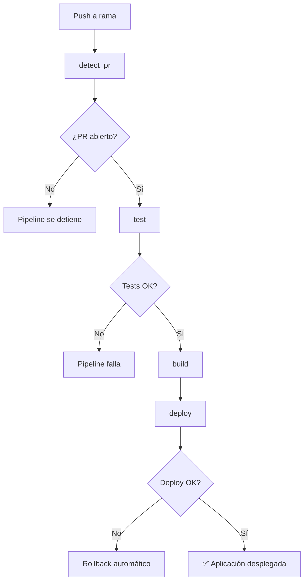

# Pipeline DevSecOps - GitHub Actions

## Descripción General

Este pipeline automatiza el proceso de CI/CD para el backend de la aplicación, ejecutándose **únicamente cuando existe un Pull Request abierto** para la rama donde se hace push.

## Flujo del Pipeline



## Jobs del Pipeline

### 1. `detect_pr`
- **Propósito**: Verifica si existe un PR abierto para la rama actual
- **Tecnología**: `actions/github-script@v7`
- **Output**: `has_open_pr: "true"|"false"`
- **Timeout**: 5 minutos

### 2. `test`
- **Propósito**: Ejecuta tests del backend
- **Tecnología**: Jest + TypeScript
- **Dependencias**: `detect_pr`
- **Condición**: Solo si `has_open_pr == 'true'`
- **Artefactos**: `test-results-${{ github.sha }}.xml`

### 3. `build`
- **Propósito**: Compila y empaqueta la aplicación
- **Tecnología**: TypeScript (`tsc`)
- **Dependencias**: `detect_pr`, `test`
- **Artefactos**: `backend-${{ github.sha }}.zip` + checksum SHA256

### 4. `deploy`
- **Propósito**: Despliega a EC2 via AWS SSM
- **Dependencias**: `detect_pr`, `test`, `build`
- **Método**: AWS Systems Manager (SSM)
- **Rollback**: Automático si falla health check

## Configuración Requerida

### GitHub Secrets

Configurar en `Settings > Secrets and variables > Actions`:

```bash
# AWS Credentials
AWS_ACCESS_KEY_ID=AKIA...
AWS_SECRET_ACCESS_KEY=...
AWS_REGION=us-east-1

# EC2 Configuration
EC2_INSTANCE_ID=i-1234567890abcdef0
EC2_HOST=ec2-xx-xx-xx-xx.compute-1.amazonaws.com

# S3 Bucket para artefactos
S3_BUCKET=my-deployment-bucket
```

### GitHub Variables

Configurar en `Settings > Secrets and variables > Actions > Variables`:

```bash
APP_PORT=3010
```

### EC2 Setup

#### 1. IAM Role para EC2
```json
{
  "Version": "2012-10-17",
  "Statement": [
    {
      "Effect": "Allow",
      "Action": [
        "s3:GetObject",
        "s3:PutObject"
      ],
      "Resource": "arn:aws:s3:::my-deployment-bucket/*"
    }
  ]
}
```

#### 2. Instalar dependencias en EC2
```bash
# Instalar Node.js 20
curl -fsSL https://deb.nodesource.com/setup_20.x | sudo -E bash -
sudo apt-get install -y nodejs

# Instalar PM2
sudo npm install -g pm2

# Instalar AWS CLI
sudo apt-get update
sudo apt-get install -y awscli

# Crear directorio de aplicación
sudo mkdir -p /opt/app/releases
sudo chown -R ubuntu:ubuntu /opt/app
```

#### 3. Configurar PM2
```bash
# Crear archivo ecosystem.config.js
cat > /opt/app/ecosystem.config.js << 'EOF'
module.exports = {
  apps: [{
    name: 'app',
    script: 'dist/index.js',
    cwd: '/opt/app/current',
    instances: 1,
    autorestart: true,
    watch: false,
    max_memory_restart: '1G',
    env: {
      NODE_ENV: 'production',
      PORT: 3010
    }
  }]
};
EOF
```

## Cómo Funciona

### Detección de PR
El pipeline usa la API de GitHub para verificar si existe un PR abierto:
```javascript
const { data: pulls } = await github.rest.pulls.list({
  owner,
  repo,
  state: 'open',
  head: `${owner}:${branch}`,
  per_page: 1
});
```

### Estrategia de Deploy
1. **Upload**: El artefacto se sube a S3
2. **Download**: EC2 descarga el artefacto via AWS CLI
3. **Extract**: Se descomprime en `/opt/app/releases/$GITHUB_SHA`
4. **Install**: Se instalan dependencias de producción
5. **Switch**: Se actualiza el symlink `current`
6. **Restart**: Se reinicia la aplicación con PM2
7. **Health Check**: Se verifica que la app responda en el puerto 3010
8. **Rollback**: Si falla, se revierte a la versión anterior

### Layout en EC2
```
/opt/app/
├── releases/
│   ├── abc123def/          # Versión actual
│   └── previous/           # Versión anterior (rollback)
├── current -> releases/abc123def/  # Symlink
└── ecosystem.config.js     # Configuración PM2
```

## Monitoreo y Debugging

### Logs del Pipeline
- **GitHub Actions**: Ver en la pestaña "Actions" del repositorio
- **EC2 Deploy**: Logs capturados en SSM Command Invocation
- **Application**: `pm2 logs app` en EC2

### Health Check
```bash
# Verificar estado de la aplicación
curl http://localhost:3010/

# Verificar PM2
pm2 status
pm2 logs app
```

### Rollback Manual
```bash
# En EC2, revertir a versión anterior
cd /opt/app
sudo rm current
sudo ln -s releases/previous current
pm2 restart app
```

## Troubleshooting

### Pipeline no se ejecuta
- ✅ Verificar que existe un PR abierto para la rama
- ✅ Revisar logs del job `detect_pr`

### Tests fallan
- ✅ Revisar logs del job `test`
- ✅ Verificar que `npm test` funciona localmente
- ✅ Revisar configuración de Jest

### Build falla
- ✅ Verificar que `npm run build` funciona localmente
- ✅ Revisar configuración de TypeScript

### Deploy falla
- ✅ Verificar credenciales AWS
- ✅ Verificar que EC2 tiene acceso a S3
- ✅ Verificar que SSM está habilitado en EC2
- ✅ Revisar logs de SSM Command Invocation

### Health Check falla
- ✅ Verificar que la aplicación está corriendo: `pm2 status`
- ✅ Verificar puerto: `netstat -tlnp | grep 3010`
- ✅ Revisar logs de la aplicación: `pm2 logs app`

## Seguridad

### Permisos Mínimos
- `contents: read` - Para checkout
- `actions: read` - Para cache
- `checks: write` - Para anotaciones
- `pull-requests: read` - Para detectar PRs

### Credenciales
- ✅ AWS credentials en GitHub Secrets
- ✅ No credenciales hardcodeadas en el código
- ✅ Uso de IAM roles cuando sea posible

### Validación
- ✅ Checksum SHA256 de artefactos
- ✅ Health check post-deploy
- ✅ Rollback automático en caso de fallo

## Mejoras Futuras

- [ ] Notificaciones Slack/Teams en caso de fallo
- [ ] Métricas de deployment (tiempo, éxito/fallo)
- [ ] Blue-green deployment
- [ ] Tests de integración post-deploy
- [ ] Monitoreo de performance
